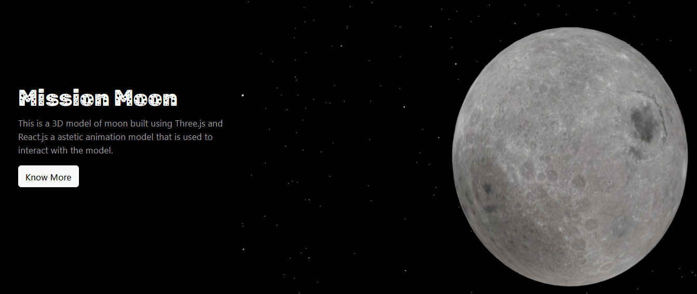

# Three.js
 Projects on three.js with react and web gui
 
 1)3dMoon
 
 - Interactive, Realistic  3D Moon 
 - built using three.js and web gui, its a interactive 3d model of moon connected to a landing page built on react
 - To install clone the repository 
 - cd 3dMoon
 - npm install 
 - npm start

# serve on a server
 - serve -s build